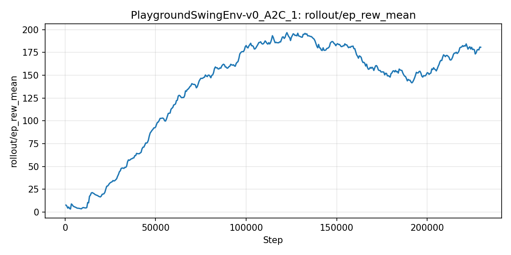
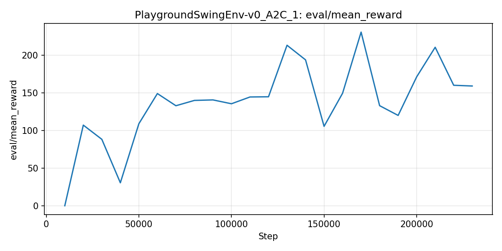

## Playground Swing RL

Reinforcement Learning project that learns to pump a playground swing. It includes a custom Gymnasium environment (`PlaygroundSwingEnv-v0`), Stable-Baselines3 training script, demo playback with reference strategies, tests, and tooling to export learning curves from TensorBoard logs.

### Features
- **Custom environment**: Physics-inspired swing dynamics with rich render modes: `human`, `human_plots`, `rgb_array`, `rgb_array_plots`.
- **Training**: One-liner training using Stable-Baselines3 with checkpoints, best-model saving, and TensorBoard logging.
- **Demos**: Compare strategies: none, random, feature-based policy (FFM), or a trained RL agent. Video recordings included in `videos/`.
- **Results plots**: Simple script to plot rewards directly from `reports/`.
- **Tests**: Basic env compliance and random-step smoke test.

### Project structure
```
playground_swing_rl/       # Environment package
  env/playground_swing.py  # Custom Gymnasium env
scripts/
  train_agent.py           # SB3 training entrypoint
  demo.py                  # Run strategies / record videos
  plot_from_csv.py         # Plot rewards from CSVs in reports/
models/
  logs/PlaygroundSwingEnv-v0_A2C_*/  # TensorBoard runs
  PlaygroundSwingEnv-v0_A2C_*/       # Saved checkpoints & best model
videos/                    # Sample rendered episodes
tests/                     # Pytest env checks
```

### Installation
Prerequisites: Python 3.10+, Windows/Linux/macOS.

```bash
python -m venv .venv
.venv\Scripts\activate  # Windows
# source .venv/bin/activate  # Linux/macOS

pip install --upgrade pip
pip install -e .
pip install stable-baselines3[extra] matplotlib numpy gymnasium
```

If you prefer, you can also use the provided `swing-rl` virtual environment in the repo, but a fresh venv is recommended.

### Usage

#### 1) Train an agent
```bash
python scripts/train_agent.py --gymenv PlaygroundSwingEnv-v0 --sb3_algo A2C
```
- Models are saved under `models/PlaygroundSwingEnv-v0_A2C_<run_id>/`.
- TensorBoard logs are saved under `models/logs/PlaygroundSwingEnv-v0_A2C_<run_id>/`.

View live training curves with TensorBoard:
```bash
tensorboard --logdir models/logs
```

#### 2) Run a demo / record video
```bash
python scripts/demo.py --strategy ffm --episodes 1 --render rgb_array_plots --save videos/
python scripts/demo.py --strategy trained --sb3_algo A2C --model_dir models\\PlaygroundSwingEnv-v0_A2C_1\\best_model.zip --render rgb_array_plots --episodes 1 --save videos/
```

#### 3) Plot rewards from CSVs
Assumes CSVs are present under `reports/` (provided in this repo). Create two plots for training and evaluation:
```bash
python scripts/plot_from_csv.py --csvdir reports --outdir reports/plots
```

### Environment details
- Observation: `[theta, theta_dot, phi, phi_dot, psi, psi_dot]`
- Action: 2D continuous accelerations for torso (phi) and legs (psi), range [-1, 1]
- Reward: Encourages increase in swing angular speed vs. initial speed
- Termination: Episode length limit; truncation handled by Gymnasium wrappers
- Render modes:
  - `human` and `human_plots`: interactive plots showing phase and trajectories
  - `rgb_array` and `rgb_array_plots`: array frames for video recording

See `playground_swing_rl/env/playground_swing.py` for full dynamics and rendering.

### Testing
```bash
pytest -q
```

### Example results
Sample videos are in `videos/` and models/logs contain TensorBoard data. Use the export script to generate standalone images for GitHub.

#### Learning curves (A2C)

Training: episode mean reward (rollout)



Evaluation: mean reward



#### Demo video

<video src="videos/trained-video-episode-0.mp4" controls width="640"></video>

### License
MIT License. See `LICENSE`.

### Acknowledgements
- Built with Gymnasium and Stable-Baselines3.
- Physics equations adapted from the paper “Initial phase and frequency modulations of pumping a playground swing”.
- Inspiration and conceptual explanation from Matthew Chapman’s blog post “The physics of a playground swing” [link](https://zmatt.net/physics-of-a-playground-swing/).


